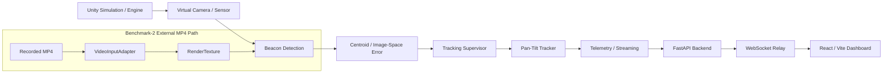

# SIH26-SYNC-FSOC

This repository implements a software-in-the-loop (SIL) virtual FSOC coarse-alignment and tracking system developed for Smart India Hackathon 2026 Problem Statement 26169. The project combines a Unity-based virtual optical environment, a detector/tracking pipeline, a FastAPI telemetry bridge, and a React dashboard for real-time validation and benchmarking. The repo is structured around a classical image-based beacon detector and PTZ control loop, with an external MP4 benchmark path for recorded-video evaluation and an optional routing layer for AI/classical detector selection.

## 1. Problem Statement

Mobile free-space optical communication (FSOC) terminals require precise pointing, acquisition, and tracking to maintain a remote optical beacon within the camera field of view. In practice, coarse alignment is the first critical step: the system must detect a beacon in the image, estimate its centroid, and continuously drive the camera/PTZ so the target remains centered. Physical camera testing, live optical benches, and PTZ hardware validation are expensive and difficult to repeat at scale.

This repository addresses that gap by providing a configurable software-based/SIL environment for development, testing, and benchmarking of the acquisition and coarse-tracking loop. The implementation is built around a virtual camera, a target/beam model, image-space error estimation, PTZ motion control, telemetry flow, and dashboard-driven validation, without requiring a dedicated hardware setup for early engineering work.

## 2. Solution Overview

The implemented architecture follows a clear virtual-sensor pipeline:

Unity Virtual Environment
→ Virtual Camera / Sensor
→ Beacon Detection / Computer Vision
→ Centroid / Image-Space Error
→ Tracking / Visual Servoing
→ Virtual Pan-Tilt
→ Telemetry
→ WebSocket Relay
→ Web Dashboard
→ Benchmark / Reporting

Implementation-wise, the repository separates three main concerns:

1. Unity simulation and engineering engine
   - Virtual camera, beacon generation, target motion, sensor processing, disturbances, PTZ control, and benchmarking run in Unity.
   - The core logic is in `Assets/Scripts/*` and `Assets/PS_Core/Scripts/*`.

2. Web-based mission control and validation platform
   - A FastAPI backend relays telemetry and command traffic between Unity and the web dashboard.
   - A React + Vite frontend visualizes live metrics, sensor/simulation streams, and benchmark controls.

3. Benchmark-2 external MP4 evaluation path
   - `VideoInputAdapter` and related Unity logic allow the same detection/tracking pipeline to consume an external MP4 as the input sensor stream.
   - In this mode, the pipeline is intentionally decoupled from the live PTZ camera path and uses the recorded video as the sensor feed.

The codebase therefore supports both a live virtual sensor flow and a recorded-video benchmark flow, each driven through the same detector and tracking logic.

## 3. Key Features

The following features are implemented and verified in the repository:

- Configurable virtual environment and PS parameter set (`PSConfiguration`)
- Virtual camera setup with RenderTexture outflow (`VirtualCameraSetup`)
- Beacon/target generation and spotting logic (`BeaconSpotController`)
- Target motion profiles (`UAVTrajectoryController`)
- Camera pan/tilt control (`PanTiltTracker`)
- Beacon detection via connected-component image processing (`BeaconDetector`)
- Centroiding and radial error estimation (`TrackingMetrics`)
- Closed-loop tracking state management (`TrackingSupervisor`)
- Disturbance/noise injection in the sensor pipeline (`DisturbanceProcessor`, `AtmosphereProcessor`)
- Camera jitter and platform motion simulation (`CameraJitterController`, `PlatformMotionController`)
- Real-time telemetry collection (`TelemetryCollector`)
- Live dashboard and telemetry display (React frontend + WebSocket relay)
- Simulation visual streaming (`UnitySimulationStreamPublisher`)
- Sensor visual streaming (`UnitySensorStreamPublisher`)
- Command WebSocket channel between frontend and Unity (`UnityCommandWebSocketClient`)
- Benchmark-2 external MP4 input flow (`VideoInputAdapter`)
- PTZ bypass mode for Benchmark-2 (`bypassActuator`)
- Performance metrics and reporting through benchmark monitoring (`PerformanceMonitor`)
- CSV/summary export flows implemented in the benchmark monitor logic

## 4. Problem Statement Parameters

The repository contains an explicit PS configuration object that defines the working parameters. The following table distinguishes the PS reference requirement from the current implementation/configuration present in code.

| Parameter | PS reference requirement | Current implementation/configuration |
| --- | --- | --- |
| Virtual workspace / screen size | Not explicitly provided as a top-level requirement in the repo narrative; the system is built around a 640x480 sensor stream | `PSConfiguration.SensorWidth = 640`, `SensorHeight = 480` |
| Camera resolution | Intended sensor resolution is 640x480 | `PSConfiguration` is configured to 640x480 |
| Camera type | Virtual camera based optical sensor | `VirtualCameraSetup` configures a Unity `Camera` with RenderTexture output |
| FOV | Not a formal requirement file; repo uses a 4° x 3° optical geometry | `HorizontalFOV = 4f`, `VerticalFOV = 3f` in `PSConfiguration` |
| Camera update rate | Not formally externalized beyond runtime operation | `CameraUpdateRateHz = 30` |
| Beacon size | Minimum / default / maximum beacon pixel dimensions defined by the benchmark limits | `MinimumPixelSize = 5`, `DefaultPixelWidth = 10`, `DefaultPixelHeight = 10`, `MaximumPixelSize = 20` |
| Target motion modes | Target motion is expected to vary by scenario | `UAVTrajectoryController` implements trajectory modes such as straight line, orbit/circular, figure-8, and random motion |
| Pan speed | Limit defined by the problem specification context | `DefaultMaxPanSpeedDegPerSec = 5f`, `MaximumAllowedPTZSpeed = 10f` |
| Tilt speed | Limit defined by the problem specification context | `DefaultMaxTiltSpeedDegPerSec = 5f`, `MaximumAllowedPTZSpeed = 10f` |
| PTZ update rate | The control loop runs at a regular cadence | `ControlUpdateRateHz = 20` |
| Acquisition target | Initial lock should be achieved rapidly | `MaxAcquisitionTimeSec = 2` |
| Tracking error target | Tracking error must stay inside a threshold | `MaxTrackingErrorPixels = 10` |
| Reacquisition target | Recovery should happen quickly after target loss | `MaxReacquisitionTimeSec = 1` |
| FPS target | Real-time processing requirement | `MinimumProcessingFPS = 20` |
| Disturbance limits | Sensor and platform distortions are bounded by the PS environment | `MaxNoiseStandardDeviation = 20`, `MaxCameraJitterPixelsPerFrame = 20`, `MaxPlatformMotionPixelsPerFrame = 20` |

Important note: the repository contains acceptance-style evaluators and target thresholds, but the README should describe these as configured limits and acceptance checks rather than as guaranteed end-to-end performance results. The actual runtime performance is runtime-dependent.

## 5. System Architecture



The Unity side provides the sensor pipeline and control loop. The backend is a FastAPI process that accepts Unity telemetry and image streams, and then relays them to the React dashboard. The dashboard provides live monitoring and command control. In the Benchmark-2 path, video input is used as the sensor signal and the PTZ camera path is bypassed through `bypassActuator` in `PanTiltTracker` and `VideoInputAdapter` logic.

## 6. Unity System

The Unity project is the primary simulation and engineering environment. It includes the following notable script families and responsibilities:

- `BeaconDetector` — connected-component pixel detector that inspects a RenderTexture and computes the beacon centroid, bounding box, and confidence; it also switches between virtual-camera and video-input sensor feeds.
- `TrackingSupervisor` — tracks target detection state across acquisition, lock, predicting, reacquiring, searching, and lost states; estimates pixel velocity and commands the PTZ controller.
- `PanTiltTracker` — converts image-space error to pan/tilt command rates using a PID-style angular controller and enforces motion limits.
- `TrackingMetrics` — computes error metrics, lock retention, acquisition time, RMSE-style values, and run-state metrics.
- `PerformanceMonitor` — collects benchmark samples and generates CSV/summary-style benchmark outputs.
- `TelemetryCollector` — snapshots Unity run state, tracking metrics, trajectory, camera settings, and PTZ status for WebSocket publication.
- `UnityTelemetryWebSocketPublisher` — sends telemetry JSON to the backend telemetry relay.
- `UnitySimulationStreamPublisher` — publishes simulation frames to the dashboard.
- `UnitySensorStreamPublisher` — publishes the sensor frame stream to the dashboard.
- `UnityCommandWebSocketClient` — receives command messages from the dashboard and routes them to the Unity runtime.
- `VideoInputAdapter` — wraps a `VideoPlayer` and RenderTexture, enabling MP4 playback as an external sensor feed.
- `UAVTrajectoryController` — powers target motion profiles for trajectory scenarios.
- `PSConfiguration` — central global configuration for sensor geometry, PTZ limits, trajectory limits, and benchmark thresholds.

The repo also contains benchmark and setup support scripts such as `HeadlessTestRunner`, `RealTelemetryTestRunner`, and `SetupTelemetryBridge`, which are used for validation and experiment wiring rather than production deployment.

## 7. AI / Computer Vision / Tracking Pipeline

The actual code path implemented in the repository is a classical image-based detection and tracking pipeline rather than a deep-learning pipeline.

The sequence implemented in the code is:

1. Sensor acquisition
   - The Unity camera produces a RenderTexture output.
   - `SensorProcessor` converts the camera image to a monochrome processing stream.
   - `AtmosphereProcessor` and `DisturbanceProcessor` can modify the image in the sensor pipeline before detection.

2. Detector
   - `BeaconDetector` processes the active sensor texture using a brightness threshold and connected-component blob extraction.
   - The code scans the image, finds bright connected regions, rejects invalid blob sizes, and scores candidate blobs.

3. Centroiding and error computation
   - The detector computes the centroid and bounding box of the best-valid blob.
   - `TrackingMetrics` computes image-space error relative to the sensor center and calculates radial error and related metrics.

4. Tracking state machine
   - `TrackingSupervisor` moves through states such as `SEARCHING`, `ACQUIRING`, `LOCKED`, `PREDICTING`, `REACQUIRING`, and `LOST` based on target detection and threshold logic.
   - The implementation includes a reacquisition sequence with search patterns and predictive coasting logic.

5. Pan/tilt command generation
   - `PanTiltTracker` converts image-space error to angular error and then computes PID-style pan/tilt commands.
   - It applies deadbanding, integral clamping, feed-forward motion, and output smoothing.

6. Image-space feedback and lock behavior
   - The loop operates on pixel error and uses the camera geometry to generate angular motion commands.
   - The tracking state only allows active PTZ motion during acquisition, lock, and reacquisition behavior as coded in `PanTiltTracker` and `TrackingSupervisor`.

This implementation is explicitly image-based and classical in operation. No deep-learning inference model is present in the code paths inspected for this repository.

## 8. Disturbance & Test Environment

The repository includes an environmental disturbance pipeline in `Assets/PS_Core/Scripts`.

Supported implemented disturbance types include:

- Gaussian noise (`DisturbanceType.Gaussian`)
- Salt and pepper noise (`DisturbanceType.SaltAndPepper`)
- Poisson noise (`DisturbanceType.Poisson`)
- Haze / fog / rain / low-light atmosphere effects (`AtmosphereMode.Haze`, `Fog`, `Rain`, `LowLight`)
- Camera jitter (`CameraJitterController` with `Random` and `Sinusoidal` modes)
- Platform motion (`PlatformMotionController` with `Linear`, `Circular`, and `Random` modes)

These disturbance stages are inserted into the sensor processing chain before detection. In practical terms, they perturb the image stream and increase the difficulty of centroid estimation, lock retention, and reacquisition. The actual runtime behavior depends on the chosen disturbance settings and the active scene configuration.

## 9. Benchmark-1

Benchmark-1 is the repository’s default virtual-sensor benchmark flow.

The implemented flow is:

- A virtual target is generated and moved according to the trajectory controller.
- The Unity virtual camera captures a RenderTexture.
- The beacon detector identifies the target and computes centroid error.
- `TrackingMetrics` measures detection quality, error distributions, acquisition time, lock retention, and processing FPS.
- `TrackingSupervisor` controls whether the system is searching, acquiring, tracking, or reacquiring.
- `TelemetryCollector` emits snapshots to the telemetry bus.
- `PerformanceMonitor` records samples and supports CSV and summary report generation.

This is a live tracking benchmark in the Unity simulation environment rather than an external video replay path.

## 10. Benchmark-2

Benchmark-2 is a distinct recorded-video evaluation mode implemented through `VideoInputAdapter` and the command pipeline.

The actual flow in the repository is:

External MP4
→ VideoPlayer / video input
→ video RenderTexture
→ `BeaconDetector`
→ `TrackingSupervisor`
→ image-space error
→ tracking/control calculation
→ PTZ bypass
→ metrics/reporting

The implemented code explicitly supports this mode. `VideoInputAdapter` creates a RenderTexture and assigns it to the Unity `VideoPlayer` output. `BeaconDetector.LateUpdate()` checks `VideoInputAdapter.Instance.isVideoModeActive` and routes the sensor input to the video texture, and `UnitySensorStreamPublisher` also swaps to the video texture when Benchmark-2 is active. In addition, `UnityCommandWebSocketClient` accepts commands such as `video.load`, `video.play`, and `benchmark.start` and sets `PanTiltTracker.bypassActuator = true` when video mode is enabled.

This means Benchmark-2 uses recorded video as the sensor source and intentionally bypasses the live PTZ camera path, according to the code in this repository.

## 11. Real-Time Dashboard

The frontend is implemented as a React + TypeScript + Vite application under `dashboard/frontend`.

Actual frontend technologies verified in the repo:

- React 19
- TypeScript
- Vite
- JavaScript/TypeScript in the app files
- `uplot` and `uplot-react` for charting
- `lucide-react` for UI icons

The dashboard includes live monitoring of:

- telemetry values
- tracking state
- error metrics
- FPS / PTZ status
- sensor stream
- simulation stream
- benchmark controls
- command channel interactions

The frontend wires into the backend via:

- `http://127.0.0.1:8000` default API base URL
- `ws://127.0.0.1:8000/ws/dashboard` telemetry WebSocket
- `ws://127.0.0.1:8000/ws/commands/frontend` command WebSocket

Relevant frontend files include:

- `dashboard/frontend/package.json`
- `dashboard/frontend/src/services/backendUrls.ts`
- `dashboard/frontend/src/services/TelemetryStore.ts`
- `dashboard/frontend/src/services/CommandChannel.ts`
- `dashboard/frontend/src/App.tsx`

## 12. Backend

The backend is a local FastAPI service under `dashboard/backend`.

Verified framework and implementation:

- Python
- FastAPI 0.110.0
- Uvicorn
- WebSockets
- python-multipart for uploaded video handling

Actual backend endpoints implemented in `dashboard/backend/main.py`:

- `GET /` — root health-style service response
- `GET /health` — status summary and active client counts
- `POST /upload_video` — stores a video upload in a temporary directory
- `WebSocket /ws/telemetry` — Unity telemetry publisher relay
- `WebSocket /ws/dashboard` — dashboard telemetry subscriber
- `WebSocket /ws/simulation` — Unity simulation image publisher
- `WebSocket /ws/simulation-view` — dashboard simulation image subscriber
- `WebSocket /ws/sensor` — Unity sensor image publisher
- `WebSocket /ws/sensor-view` — dashboard sensor image subscriber
- `WebSocket /ws/commands/unity` — Unity command ACK channel
- `WebSocket /ws/commands/frontend` — frontend command ingress relay

The backend uses an in-memory connection manager to keep the latest telemetry, simulation frame, and sensor frame, and then broadcasts them to connected dashboard clients.

## 13. Technology Stack

| Layer | Technology | Purpose |
| --- | --- | --- |
| Simulation / control engine | Unity 6000.6.0f1 | Primary virtual environment and tracking runtime |
| Programming language | C# | Unity scripts, controllers, detectors, telemetry, benchmark logic |
| Sensor processing | RenderTexture, Unity Camera | Virtual sensor capture and image stream generation |
| Detector / pipeline | Connected-component pixel processing | Beacon detection and centroid calculation |
| Tracking logic | PID-style angular control in C# | Pan/tilt error correction |
| Pipeline inputs | VideoPlayer, MP4 video | Benchmark-2 recorded-video input |
| Backend API | FastAPI | WebSocket relay and REST services |
| Backend runtime | Python | FastAPI application and video upload handling |
| Frontend | React, TypeScript, Vite | Dashboard UI and WebSocket clients |
| Charting | uPlot | Real-time telemetry plotting |
| Real-time transport | WebSocket | Telemetry, command, and visual stream relay |
| Version control | Git / GitHub | Repository and source control |

## 14. Local Setup

### Unity

Required software:

- Unity 6000.6.0f1 or a compatible Unity 6 editor (`ProjectSettings/ProjectVersion.txt`)
- A working Unity project opened at the repository root

Recommended workflow:

1. Open the repo root in Unity.
2. Open `Assets/Scenes/FSOC_Main.unity`.
3. Ensure the scene includes the `VirtualCamera`, target objects, PTZ, and telemetry bridge objects as expected by the Unity scripts.
4. Run the scene in the Unity Editor to start the simulation.

The repo contains editor helper scripts for setup and testing, including `SetupTelemetryBridge`, `HeadlessTestRunner`, and `RealTelemetryTestRunner`.

### Backend

From the repository root:

```bash
cd dashboard/backend
python -m venv .venv
source .venv/bin/activate   # Windows: .venv\Scripts\activate
pip install -r requirements.txt
uvicorn main:app --host 127.0.0.1 --port 8000
```

Default local backend URLs:

- API base: `http://127.0.0.1:8000`
- Telemetry WebSocket: `ws://127.0.0.1:8000/ws/telemetry`
- Dashboard WebSocket: `ws://127.0.0.1:8000/ws/dashboard`
- Command WebSocket (Unity): `ws://127.0.0.1:8000/ws/commands/unity`
- Command WebSocket (frontend): `ws://127.0.0.1:8000/ws/commands/frontend`

### Frontend

From the repository root:

```bash
cd dashboard/frontend
npm install
npm run dev
```

The frontend defaults to:

- API base: `http://127.0.0.1:8000`
- Vite dev server: typically `http://localhost:5173`

The app uses the environment variables defined in `dashboard/frontend/src/services/backendUrls.ts`:

- `VITE_API_BASE_URL`
- `VITE_COMMAND_WS_URL`

These are optional; if not set, the app falls back to the local `127.0.0.1:8000` equivalents.

## 15. Production Architecture / Deployment

The repository does not contain a verified production deployment configuration for a live hosted environment. There are no deployment manifests, CI/CD deployment files, or hosting configuration files in the inspected repo that clearly establish a Vercel/Render deployment path.

The current code and configuration show a local development/engineering architecture:

Browser
→ local React/Vite frontend
→ local FastAPI backend
↔ Unity runtime on the same or adjacent local host

The repository does, however, include the following real WebSocket channels in the backend:

- `/ws/telemetry`
- `/ws/dashboard`
- `/ws/simulation`
- `/ws/simulation-view`
- `/ws/sensor`
- `/ws/sensor-view`
- `/ws/commands/unity`
- `/ws/commands/frontend`

These are implemented in the code and should be treated as locally configured engineering interfaces rather than as a verified production deployment system.

## 16. Performance & Acceptance Metrics

This repository contains performance acceptance logic and threshold values, but the actual runtime values are not automatically verified by a static CI test in this repo. The following table distinguishes configured acceptance targets from runtime-dependent observations.

| Metric | PS Requirement | Current observable metric / status |
| --- | --- | --- |
| Acquisition time | Maximum 2 seconds | Configured in `PSConfiguration.MaxAcquisitionTimeSec = 2`; runtime-dependent |
| Tracking error | Maximum 10 pixels | Configured in `PSConfiguration.MaxTrackingErrorPixels = 10`; runtime-dependent |
| RMSE | Not a guaranteed static value | `TrackingMetrics.RMSE` is computed at runtime |
| Target loss | Maximum 5% | `PSConfiguration.MaxTargetLossPercent = 5` and `TrackingMetrics.LossRate` are runtime-dependent |
| Reacquisition time | Maximum 1 second | Configured in `PSConfiguration.MaxReacquisitionTimeSec = 1`; runtime-dependent |
| Lock retention | Calculated during runtime | `TrackingMetrics.LockRetentionPercentage` computed dynamically |
| FPS | Minimum 20 FPS | `MinimumProcessingFPS = 20` in `PSConfiguration`; runtime-dependent |
| PTZ update rate | Control loop cadence requirement | `ControlUpdateRateHz = 20`; runtime-dependent |

The code logs acceptance-style metrics such as `PSAcceptance` in the Unity logs, but actual pass/fail should be interpreted as a runtime-determined engineering condition rather than as a guaranteed claim.

## 17. Project Flow

### Standard virtual-sensor workflow

Configure Scenario
→ Generate Target
→ Capture Sensor Image
→ Detect Beacon
→ Compute Centroid
→ Compute Error
→ Generate PTZ Command
→ Track
→ Measure
→ Log
→ Report

### Benchmark-2 workflow

Configure Benchmark-2
→ Load MP4
→ Enable video mode
→ Create video RenderTexture
→ Feed into detector
→ Compute centroid/error
→ Generate tracking/control outputs
→ Bypass PTZ actuator
→ Measure and report

The repository’s Benchmark-2 path is implemented through `VideoInputAdapter` and the command flow in `UnityCommandWebSocketClient`.

## 18. Repository Structure

The actual repository structure is organized around Unity assets, PS core simulation modules, and a paired dashboard stack.

```text
.
├── .gitignore
├── .vscode/
├── Assets/
│   ├── Editor/
│   ├── Materials/
│   ├── PS_Core/
│   ├── Scenes/
│   ├── Scripts/
│   ├── Settings/
│   ├── Shaders/
│   └── TextMesh Pro/
├── Packages/
├── ProjectSettings/
├── dashboard/
│   ├── backend/
│   └── frontend/
├── tools/
└── README.md
```

The repository is primarily a Unity project with additional dashboard modules under `dashboard/`.

## 19. Research / Engineering Value

The repository is best understood as a repeatable simulation and validation environment for FSOC coarse alignment and tracking research. It provides:

- repeatable SIL experimentation using a controllable virtual sensor and target environment
- controlled disturbance injection for testing adverse conditions
- algorithm verification in a consistent Unity-based environment
- measurable performance metrics for detection, tracking error, lock retention, FPS, and reacquisition
- external video benchmarking via the MP4 pipeline
- reduced dependence on physical hardware during early engineering and validation work

This is an engineering and research demonstrator, not a flight-qualified or hardware-qualified system.

## 20. Limitations & Future Work

### Current implementation

- The project is a software-in-the-loop simulator and benchmark harness; it is not a verified hardware-in-the-loop or field deployment system.
- Detection is implemented through classical connected-component blob detection rather than a learned vision model.
- The dashboard and backend form a local engineering interface, not a production-hosted deployment stack.
- Environmental effects are implemented as configurable visual distortion layers and not as a full optical propagation model.
- Benchmark-2 is implemented for recorded video input but is still a software validation path rather than a production field-data flow.

### Possible future improvements

- Replace or extend the classical detector with additional detector modes if the project evolves.
- Add a more formal deployment and environment configuration for hosted operation.
- Expand the benchmark and reporting framework for automated acceptance workflows.
- Formalize the benchmark results pipeline for export, comparison, and regression management.
- Extend the disturbance stack toward more complete sensor physical modeling as needed.

## 21. Team / SIH Information

- SIH 2026
- Problem Statement ID: PS-26169
- Organization: ISRO / SAC
- Smart Automation / Space Technology context
- Team: SYNC

No additional team-member information was found in the repository as part of the implementation inspected here.

## 22. License

License: Not yet specified.

## 23. Status

Status: Prototype / research demonstrator.

The codebase reflects an active engineering prototype for artificial optical tracking simulation, validation, and benchmark development rather than a production deployment system.

---

This README was prepared from the repository’s actual implementation files, Unity scripts, backend endpoints, and frontend configuration. Where the repository had configurable or optional behavior, it is described as such. No source-code files were modified beyond the creation of this README.


